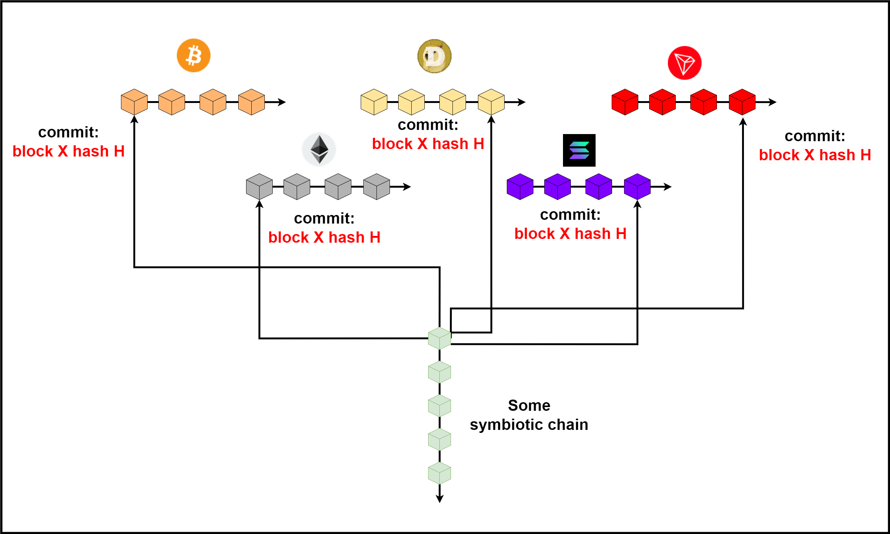

# 👨👩👦 Hostchains

## <mark style="color:red;">What is considered a hostchain?</mark>

A **hostchain** is a chain (blockchain) whose security symbiotes rely on. It can be said that this is a carrier chain (host). Depending on the hostchain and its capabilities symbiotes enter into a variety of relationships with them - from simple commits of state to advance usage like protection from unavailability, transactions over hostchains(when you interact with Solana or Tron, for example, to call some contract on symbiotic chain) and so on

Hostchains in KLY will be various reliable networks such as Bitcoin, Ethereum, Solana, Near, TON, Cardano, BNB, XRP, and so on. It is on their general decentralization, fault tolerance and security that the symbiotes in the KLY ecosystem will rely

## <mark style="color:red;">Standard process for interacting with hostchains</mark>

This was originally planned - each of the symbiotic chains just makes a checkpoint of its state into the hostchains from time to time for the purpose of long-term security. The idea was to provide the only possible state of the symbiote in the long run.


The maximum security threshold in the industry is the total resources that need to be spent on an attack on all blockchains such as PoW power to attack Bitcoin, Ethereum Classic, Monero, etc., the cost of stakes in order to become a validator on Ethereum, Solana or Avalanche, etc.


Therefore, if you make a checkpoint for example in 10 blockchains, then you can be sure that even if in the future one of them ceases to exist or undergoes a state rollback attack or ceases to be decentralized enough, the state of the symbiote will still remain safe. This is the perfect defense against long-range attacks, Sybil attacks (because you have many decentralized data sources in the form of nodes of other blockchains that have their own economic interest in maintaining the integrity of their hostchain) and so on.

<figure><figcaption></figcaption></figure>

<figure><figcaption></figcaption></figure>

<figure><figcaption></figcaption></figure>

In fact, imagine if you want to run a node to work on some of the symbiotes in the KLY ecosystem, but you can’t figure out which of the states A or B is valid. To do this, you can look into the blockchains of Bitcoin, Solana, Avalanche, Aptos and others where you will see that the state of a certain symbiote is still A, not B.

A little later, it was decided to implement **hivemind** - a mechanism for receiving checkpoints from other symbiotic chains in order to include it in your own checkpoint, and then in your set of hostchains. This allows you to pay less(after all, transactions on hostchains cost money), but at the same time create a greater level of security.

<figure><figcaption></figcaption></figure>

## <mark style="color:red;">Security budget and how hostchains will help us</mark>

Classic blockchains that work on PoS or BFT modifications assume a standard security algorithm (which may vary depending on the project):

1. Validators place bets and freeze some value of the project currency
2. After a certain period of time (from the next era, for example), they can take part in creating blocks or voting for a certain fork (again, in different blockchains in different ways)
3. If the validator wants to stop participating, then he can unstake and after a while his stake will be unfrozen, and he himself will lose his place in the quorum

The frozen stakes of the validators are used as fraud protection and guarantee the network and participants that the validator will not vote for 2 versions of the chain (so that there are no forks), will not perform malicious actions against the network, and so on. Typically, the security threshold is N/3, meaning as long as less than N/3 validators are malicious or faulty, then the network will be secure.


The total value of the assets that protect the chain at a given time _**T**_ in the period _**P**_(epoch) is called the _<mark style="color:red;">**security budget**</mark>_


The larger the security budget, the more expensive it is for the attacker to attack the network, because you need to buy more seats in the quorum to attack the chain.

The process of interacting with hostchains described in the previous chapters is good for long distances. For example, we commit the state once a day, and the quorum changes every day after the checkpoint, using its hash as a pseudo-random seed to select a new quorum _**Q**_ from the total number of validators _**V**_ where _**Q\<V**_. So how is the network protected between checkpoints?

All this time, what is described at the beginning of this chapter is happening - the network (native KLY chain) is protected by the stakes of the participants in the current quorum. Let's visualize this process

<figure><figcaption></figcaption></figure>

And now let's move on to something interesting. Imagine that the _<mark style="color:purple;">**Q1**</mark>_ quorum security budget is 1 million KLY coins. As long as less than a million has been spent within the current epoch (from checkpoint to checkpoint), the network will behave 100% honestly, because from the point of view of the attacker it will be irrational to carry out an attack if the risk of losses is greater.

For example, let's imagine that the past epoch ended on block _**X**_ and this block was added to the hostchains as part of a checkpoint. Now consider a window of 100 blocks within a new epoch.

Suppose that in blocks _**X+1**_ , _**X+2**_ ..., _**X+100**_, users receive 27 000 KLY, 50 KLY and 100 KLY, and so on. Suppose that the total amount of funds sent in the interval _<mark style="color:red;">**X+1**</mark>_ <mark style="color:red;"></mark><mark style="color:red;">-</mark> <mark style="color:red;"></mark>_<mark style="color:red;">**X+100**</mark>_ is 500,000 KLY. This is half the security budget of 1 million. So, recipients of transactions on this interval can be sure that there will be no fork up to this height.

<figure><figcaption></figcaption></figure>

Otherwise, if quorum _<mark style="color:purple;">**Q1**</mark>_ decides to fork the network, then they can be slashed, take 1 million of them and return to affected users.

But what happens if the security budget is spent? Let's say that before block _**X+100**_, senders sent **999,999 KLY** in total (which is still less than 1M), but in block **X+101**, a fork attack becomes possible:

1\. You receive 100 KLY in some block X+101 with hash H\_101 and you want to get proof of finalization from the network (2 step agreement from 2/3N+1 quorum participants) to make sure that the funds reach you

2\. Some attacker manages to bribe more than N/3 members of the quorum (the minimum required threshold). Suppose he made a transaction for 2M KLY in block X+101. Let it be the purchase of some expensive goods on the Internet

**This is what happens next:**

The attacker promises N/3 networks a reward of _**1M+10,000 KLY**_ (not everyone) for N/3 voting for 2 different block versions at height _**X+101**_. Because _**1M < 1M + 10,000 KLY**_, N/3 quorum members agree. If at _**X+101**_ a block is created by an attacker, then he creates 2 blocks:

1\. Block X+101 with hash H101\_1 and transactions where it sends 1M + 10,000 KLY to validators

2\. Block X + 101 with hash H101\_2 where there will be your transaction for 100 KLY that you expect and a transaction where the attacker buys something for 2M

Then 2 block versions are sent to quorum members for signature.

If N=10 and decision threshold 7(2/3N+1) then

1\. 3 honest validators will receive a block with hash H101\_1&#x20;

2\. 3 honest validators will receive a block with hash H101\_2

3\. Malicious 4 validators receive 2 blocks and sign 2 versions

As a result, we have a fork where there are 7 votes for 2 different versions of the chain. If you receive proof of finalization on your block at this moment, you will consider that you received 100 KLY. Similarly, the seller of the goods will think that he received his 2M KLY from the attacker.

\<IMAGE>

However, the network will later decide to choose another fork - the one where the attacker sends 1M + 10,000 KLY to the malicious validators. Even if you complain about them, you will still receive a maximum of 1M KLY which is frozen as a bet.

<mark style="color:red;">**Attackers (leader) will receive:**</mark>

_Goods for 2M - 1M 10 000 KLY(for validators-attackers) = 900K KLY profit_

<mark style="color:red;">**And N/3 malicious validators) will receive:**</mark>

_1M+10000 KLY(from attacker-leader) - 1M(slashed) = 10 000 KLY profit_

So, when the security budget is not enough, you can turn to host chains. As part of our situation, you see that at block _**X+101**_ your transaction will no longer be protected by the security budget, so you should commit to the host chains. You take the block finalization proof _**X+101**_ with the hash H101\_2 and send it to the host chains. When you see that there are no conflicts in 2/3N+1 hostchains and your block is uniquely defined as block X+101, you can be 1000000000% sure that this is forever and there will be no other fork.

## <mark style="color:red;">**PoW and PoS hostchains. Advantages and disadvantages**</mark>

We have moved on to an important topic. Since all hostchains are different, they all use different consensus algorithms. This is important for KLYNTAR, as it is about what is considered a finalization, whether this hostchain can be generally trusted, and so on. The dispute between PoS and PoW supporters has not faded away for a very long time, and each of them is right in its own way. But here we will rather not talk about classical PoW and PoS, but about two large groups of algorithms:

* Those who spend real resources (through mining, wasting memory, time)
* Those who rely on the intrinsic value of their coins (PoS and modifications, various BFTs, etc.)

Some of them offer probabilistic finality, some guarantee instant finalization. In addition, often PoS proponents do not like to mention all sorts of long range attacks (when old validators create a fork from some earlier blockchain height and you now cannot know which one is valid. At the same time, slashing does not work, because old validators won't lose anything), although mining also has its own problems. Some (Zilliqa and others) are proposing a hybrid approach where PoW and PoS work together.

By having certain logic run on the symbiote workflow, you don't have to worry about communication with hostchains being expensive or under attack.

For example, in our workflow (workflows) it is planned to make sure that the validators hold the stake between commits to the hostchains. Thus, between two interactions with a hostchain, security and non-reversion is ensured by the rates of symbiote validators, and after the commit, security is already provided by the hostchains.

<mark style="color:yellow;">**Let's take an illustrative example**</mark>

 (1) (1) (1) (1).png>)

From now on, this is a new non-returning point in the history of the symbiote. Both hostchains on PoW (Bitcoin) and on PoS / BFT (Solana and Avalanche) are used here. The state of the symbiote is protected both by the resources actually spent, and by the value of virtual assets and the value of networks.

However, to speed up + reduce the cost of such interactions, the symbiote interacts with hostchains at a selected frequency - once an hour, once a day, and so on. The longer the time between interactions, the longer validators and bidders cannot unlock their bids. Their coins are used as a security deposit.

So, in our example above, the interaction happens in a new block. Let these be blocks A, B and C for Solana, Avalanche and Bitcoin, respectively.

Suppose that all this happened for a block with an index of _<mark style="color:orange;">**100,000**</mark>_ and a hash _<mark style="color:orange;">**adcdef...**</mark>_. In this case, the nodes sign this data and publish their signatures.

 (1) (1).png>)

We used multi-signatures here, which you will get acquainted with here, but for now let them be a kind of black box for you that will collect signatures and public keys of validators and aggregate them into a single proof.

As we can see above, the nodes have signed and now security and non-rollback are ensured by:

* Hostchains
* Signers on KLYNTAR

In this case, the signers' security budget is 60,000 KLY, but in general, you understand that it will be more. Moreover, workflow features are also the fact that not only direct validators can bet on the symbiote block. Third-party stakers don't even need to know what's inside - their job is to ensure the existence of a single valid chain.

<mark style="color:yellow;">**What's next?**</mark>

Since we are efficient, from block 100,000 until the next day (assuming the symbiote saves data to the hostchains once a day), security is provided by the symbiote's nodes and other signers.

They work extremely fast, generating many blocks per second (thanks to phantom blocks, which you will learn about in the next section) following the rules of their workflow.

Each block is signed in the same way as shown above, and the proof is also distributed over the network.

During the entire period between commits to the hostchains, the stakes of the signers are frozen. Thus, if necessary, they can be slashed and, if there is evidence that one of the validators signed a different version of the symbiote blocks, to deprive him of his bet.

In our example, it turns out that those who have frozen rates will not be able to unfreeze them for 1 day. As soon as the time for a new interaction session comes, the set of validators can be changed. You, if necessary, unfreeze your bet and leave with the interest earned, and other signers can be appointed in your place.

## <mark style="color:red;">Also an important appeal to the miners of current PoW projects</mark>

Do not rush to throw away the equipment. KLYNTAR will provide you with new opportunities️ 🧙‍♂️

 (1) (1) (1) (1) (1).png>)

## <mark style="color:red;">Hivemind</mark>

Hivemind is the future of KLYNTAR's hostchain enhancements. In short, the symbiotes will exchange data with each other and ensure their safety and the safety of other symbiotes by measuring the block generation time in different hostchains (for the fastest possible finalization). Also, it will favorably affect the fact that interactions with hostchains will become cheaper and faster.

## <mark style="color:red;">Methods of interaction with hostchains</mark>

Symbiotes interact with hostchains using connectors or APIs. Such interaction occurs both at the workflow level and at the service level (KLYNTAR Services).

Maturing question

> Does this mean that I will need to run hostchain nodes???

No, don't worry, everything is cooler and more interesting here. Yes, in order to interact with hostchains within workflow and KLYNTAR Services, you will need to somehow communicate with other blockchains.

Here is an example connector for EVM chains

 (1) (1) (2).png>)



It can be seen that here the Web3 module needs an endpoint address. Similar can be found in other connectors.

Here it is - if you have a node - use it, otherwise you have a whole range of possibilities:

* Use Node-as-a-Service Services
* Use public (but trusted) nodes
* Use nodes that can be rented out by those who have them

This way you can get started quickly without using your own resources. However, you should be careful - if you need to sign something on KLYNTAR after verification from the hostchain, then with false data from a malicious source, you risk losing your money.


We will publish more detailed information later



This page will be updated. Stay tuned so you don't miss anything important

