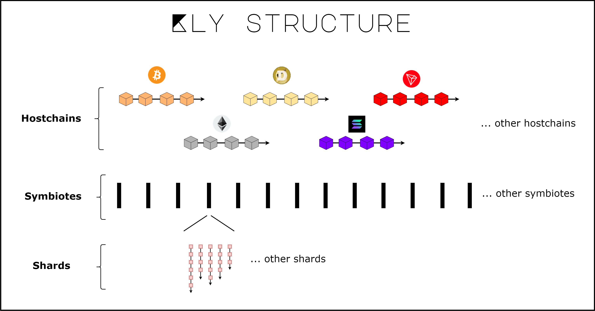

# ☕ General

## <mark style="color:red;">**Let's talk about the structure**</mark>

<figure><figcaption></figcaption></figure>

Above you see the general scheme taken from our whitepaper of the first version. Unlike other crypto projects, KLYNTAR does not have some kind of main chain, beacon chain or something like that which synchronizes and interleave work in shards or separate blockchains (like Polkadot or Cosmos). We consider the entire blockchain space as a single, reliable, homogeneous environment and each blockchain is like a certain reliable container.

KLYNTAR consists of many parallel chains that we call _<mark style="color:red;">**symbiotes**</mark>_ or _<mark style="color:red;">**symbiotic chains**</mark>_(they are represented in the diagram as parallel black rectangles). They got this name because they enter into a symbiotic relationship with other entities - _<mark style="color:red;">**hostchains**</mark>_(from the words _**host**_-carrier and _**chain**_-chain, shown at the top of the diagram) and other symbiotes(for cross-chain messaging). This connection is necessary for many reasons:

### <mark style="color:purple;">**Maximum theoretical safety**</mark>

What could be safer than all crypto projects put together? By including its state commits in the hostchains, KLYNTAR guarantees maximum security for rollbacks prevention and to finalize the updated state. To hack the KLY attacker needs to buy all the assets of PoS projects, cooperate the entire mining power of PoW projects, and get validator positions in different chains where delegation is practiced. We do not rely only on Bitcoin or only Ethereum. We do not rely on 21 validators and are not afraid of 5 mining pools. And also we are not tied to one chain, being completely dependent on it

### <mark style="color:purple;">**Movement flexibility**</mark>

If it becomes expensive to make commits on one chain then the mutation mechanism makes it easy to change the set of hostchains or workflow

### <mark style="color:purple;">Multilevel sharding</mark>

A fundamental concept that allows symbiotes to work in parallel and independently of each other, but still be able to exchange data with each other, share a common security and receive all the benefits of such an alliance. This will be a good motivation to launch blockchains in the KLY ecosystem by third-party developers.

For example, our first symbiote, which will become the native KLY chain, will have the kNULL alias in the KLYNTAR symbiote network. Other developers who decide to join our ecosystem can launch their own blockchains that will work according to their rules, with their own consensus, and so on. Moreover, thanks to the use of virtualization technologies and the decentralized cloud project Thundercloud (by KLY), you will be able to run and manage your blockchains in a serverless mode.

As for sharding at the second level (the level of one symbiote), this will allow you to divide the load into several sub-chains - shards. Thus, already within the same blockchain, you can independently check several sub-chains, track only a few of them or even 1, and so on.

### <mark style="color:purple;">**Rationality**</mark>

It would be illogical if we had a single KLYNTAR chain linearly and stupidly included its commits in all projects. It even sounds scary. After all, then you need to track all the other chains + it would be expensive and unprofitable.

However, due to the fact that we have an infinite number of parallel symbiotes, you can choose to run a node or cluster with one, two or more symbiotes to track and work on it. Symbiotes interact with each other to include commits of their states in more networks.

So one symbiote can commit to Bitcoin, Polygon, and Solana, and the other can commit to XRP, Litecoin, and Cardano. They include each other's commits in their set of hostchains, and each of them pays a fee on only three networks, but in reality, there are now 6 hostchains guarding their security. This was the simplest example

### <mark style="color:purple;">**Ecosystem of blockchains**</mark>

It's a nice idea to set the messaging protocol for easy interaction between pairs _**symbiote <-> symbiote**_

## <mark style="color:red;">**More about hostchains**</mark>

Why tie yourself to one circuit if you can immediately secure it to the maximum using various flexible circuits. With this thought, we sat when we planned the architecture and studied the documentation of other projects. We also know about the principle of operation of Polygon, various L2 projects on Ethereum, about RSK and even about Stacks, but KLYNTAR is about something else.&#x20;

By communicating with many chains, KLYNTAR brings security for them too, due to the fact that KLYNTAR node and cluster operators can also run hostchain nodes and due to the fact that we rely on the security of hostchains(which means we are interested in their market value and development). We will talk about the trust market further and believe me, even if you now have a running infrastructure of other cryptocurrencies, you will already be useful on KLYNTAR and will be able to get what you need here.

## <mark style="color:red;">**More about symbiotes**</mark>

Anyone can create their own new blockchain and attach it to the rest of the symbiotes. At the same time, your blockchain (symbiote) will immediately receive the security of KLYNTAR, will be supported by KLYNTAR nodes, and so on.
