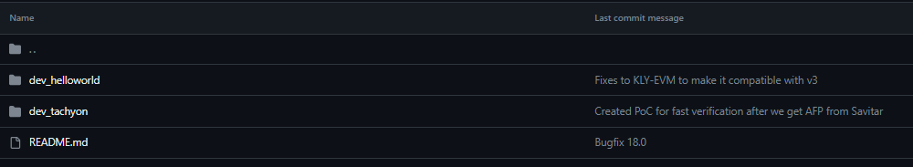

# 👽 Symbiotic chains

## <mark style="color:red;">**What is a symbiotic chain?**</mark>


_<mark style="color:red;">**Symbiote(symbiotic chain)**</mark>_ is a separate chain in KLY ecosystem that has its own genesis, own history, state, works following its own workflows and interacts with its own set of hostchains



<figure><figcaption></figcaption></figure>

In the image above, you can see an example of an ecosystem running 1 native blockchain (our KLY blockchain) and some other blockchains. Something like in Polkadot or Cosmos. Third party companies, organizations and teams will be able to host their blockchains in the KLY ecosystem and benefit from coexistence. This is similar to military or economic alliances in the real world and in such a scheme, often, the participating members are clearly in a better position than if they were a single separate entity.

## <mark style="color:red;">Symbiotic chain components</mark>

<figure><figcaption></figcaption></figure>

### <mark style="color:orange;">**Workflow**</mark>

The first and the main component of each symbiote is a workflow.

_**Workflow**_ - a model of how some blockchain works. Here the consensus is determined, the set of essences is determined (different transactions), the set of routes for the server is determined (for communication between nodes) and much more. Let's figure it out.

Workflows that will be used by KLY core are located in the **KLY\_Workflows** directory

<figure><figcaption></figcaption></figure>

Other workflows can be created as a separate repository and to sign other devs about your work you can open a pull request to add the link to your custom workflow . You can see it on GitHub



Let's look at the dev\_tachyon structure in more detail so that you understand. And although we will conduct a more detailed acquaintance in the following parts (about workflows and directly **dev\_tachyon**), we will nevertheless start our acquaintance here

<figure><figcaption></figcaption></figure>

Directory **essences** describes block and transaction structure

<figure><figcaption></figcaption></figure>



Directory **templates** includes templates for genesis and configs for this workflow

<figure><figcaption></figcaption></figure>


It is considered good practice to create highly customized workflows with modular components. We will talk about this in the following sections.


### <mark style="color:orange;">**Genesis**</mark>

It all starts with genesis. Here, depending on the workflow, you should set the initial values - the balances of some accounts, preset contracts, parameters, and so on.

For example, consider the genesis for our main workflow _**dev\_tachyon**_( our native kNULL chain will run on it). This is the example for a 4-validators network with 3 primary and 1 reserve pools

```json
{
    "VERSION":0,

    "POOLS":{

        "7GPupbq1vtKUgaqVeHiDbEJcxS7sSjwPnbht4eRaDBAEJv8ZKHNCSu2Am3CuWnHjta":{
        
            "percentage":0.5,
            "overStake":10000,
            "whiteList":[],
            "totalPower":55000,
            "lackOfTotalPower":false,
            "stopCheckpointID": -1,
            "storedMetadata": {},
            "isReserve":false,
            "stakers":{
                "7GPupbq1vtKUgaqVeHiDbEJcxS7sSjwPnbht4eRaDBAEJv8ZKHNCSu2Am3CuWnHjta":{
                    "kly":55000,
                    "uno":0
                }
            },
            "waitingRoom":{},
            "poolURL":"http://localhost:7332",
            "wssPoolURL":"wss://localhost:9332"
        
        },
        "75XPnpDxrAtyjcwXaATfDhkYTGBoHuonDU1tfqFc6JcNPf5sgtcsvBRXaXZGuJ8USG":{
        
            "percentage":0.5,
            "overStake":10000,
            "whiteList":[],
            "totalPower":55000,
            "lackOfTotalPower":false,
            "stopCheckpointID": -1,
            "storedMetadata": {},
            "isReserve":false,
            "stakers":{
                "75XPnpDxrAtyjcwXaATfDhkYTGBoHuonDU1tfqFc6JcNPf5sgtcsvBRXaXZGuJ8USG":{
                    "kly":55000,
                    "uno":0
                }
            },
            "waitingRoom":{},
            "poolURL":"http://localhost:7333",
            "wssPoolURL":"wss://localhost:9333"
        
        },
        "61TXxKDrBtb7bjpBym8zS9xRDoUQU6sW9aLvvqN9Bp9LVFiSxhRPd9Dwy3N3621RQ8":{
        
            "percentage":0.5,
            "overStake":10000,
            "whiteList":[],
            "totalPower":55000,
            "lackOfTotalPower":false,
            "stopCheckpointID": -1,
            "storedMetadata": {},
            "isReserve":false,
            "stakers":{
                "61TXxKDrBtb7bjpBym8zS9xRDoUQU6sW9aLvvqN9Bp9LVFiSxhRPd9Dwy3N3621RQ8":{
                    "kly":55000,
                    "uno":0
                }
            },
            "waitingRoom":{},
            "poolURL":"http://localhost:7334",
            "wssPoolURL":"wss://localhost:9334"
        
        },
        "6YHBZxZfBPk8oDPARGT4ZM9ZUPksMUngyCBYw8Ec6ufWkR6jpnjQ9HAJRLcon76sE7":{
        
            "percentage":0.5,
            "overStake":10000,
            "whiteList":[],
            "totalPower":55000,
            "lackOfTotalPower":false,
            "stopCheckpointID": -1,
            "storedMetadata": {},
            "isReserve":true,
            "reserveFor":"7GPupbq1vtKUgaqVeHiDbEJcxS7sSjwPnbht4eRaDBAEJv8ZKHNCSu2Am3CuWnHjta",
            "stakers":{
                "6YHBZxZfBPk8oDPARGT4ZM9ZUPksMUngyCBYw8Ec6ufWkR6jpnjQ9HAJRLcon76sE7":{
                    "kly":55000,
                    "uno":0
                }
            },
            "waitingRoom":{},
            "poolURL":"http://localhost:7335",
            "wssPoolURL":"wss://localhost:9335"
        
        }

    },

    "CHECKPOINT_TIMESTAMP":1689867363979,
 
    "STATE":{

        "7GPupbq1vtKUgaqVeHiDbEJcxS7sSjwPnbht4eRaDBAEJv8ZKHNCSu2Am3CuWnHjta":{
            
            "type":"account",
            "balance":200000,
            "uno":0,
            "nonce":0,
            "rev_t":0,
            "subchain":"7GPupbq1vtKUgaqVeHiDbEJcxS7sSjwPnbht4eRaDBAEJv8ZKHNCSu2Am3CuWnHjta"
        },
        "75XPnpDxrAtyjcwXaATfDhkYTGBoHuonDU1tfqFc6JcNPf5sgtcsvBRXaXZGuJ8USG":{
            
            "type":"account",
            "balance":200000,
            "uno":0,
            "nonce":0,
            "rev_t":0,
            "subchain":"7GPupbq1vtKUgaqVeHiDbEJcxS7sSjwPnbht4eRaDBAEJv8ZKHNCSu2Am3CuWnHjta"
            
        },
        "61TXxKDrBtb7bjpBym8zS9xRDoUQU6sW9aLvvqN9Bp9LVFiSxhRPd9Dwy3N3621RQ8":{
            
            "type":"account",
            "balance":200000,
            "uno":0,
            "nonce":0,
            "rev_t":0,
            "subchain":"7GPupbq1vtKUgaqVeHiDbEJcxS7sSjwPnbht4eRaDBAEJv8ZKHNCSu2Am3CuWnHjta"
        },
        "6YHBZxZfBPk8oDPARGT4ZM9ZUPksMUngyCBYw8Ec6ufWkR6jpnjQ9HAJRLcon76sE7":{
            
            "type":"account",
            "balance":200000,
            "uno":0,
            "nonce":0,
            "rev_t":0,
            "subchain":"7GPupbq1vtKUgaqVeHiDbEJcxS7sSjwPnbht4eRaDBAEJv8ZKHNCSu2Am3CuWnHjta"
        },

        "0000000000000000000000000000000000000000000000000000000000000000":{
            
            "type":"contract",
            "lang":"RUST",
            "balance":0,
            "uno":0,
            "storages":["storageID_N"],
            "bytecode":"00",
            "subchain":"7GPupbq1vtKUgaqVeHiDbEJcxS7sSjwPnbht4eRaDBAEJv8ZKHNCSu2Am3CuWnHjta",

            "storageID_N":{
                "key1":"value1",
                "keyN":"valueN"
            }

        }

    },

    "EVM":{

        "7GPupbq1vtKUgaqVeHiDbEJcxS7sSjwPnbht4eRaDBAEJv8ZKHNCSu2Am3CuWnHjta":{

            "0x407d73d8a49eeb85d32cf465507dd71d507100c1":{
            
                "nonce": 0,
                "balance":100,
                "code":"",
                "storage":{}
    
            },
    
            "0x4741c39e6096c192Db6E1375Ff32526512069dF5":{
                
                "nonce": 0,
                "balance":100,
                "code":"",
                "storage":{}
    
            },
    
            "0x0000000000000000000000000000000000000007":{
                
                "isContract":true,
                "nonce": 0,
                "balance":100,
                "code":"608060405234801561001057600080fd5b5060405161064e38038061064e83398101604081905261002f91610071565b600061003b82826101dc565b505061029b565b7f4e487b7100000000000000000000000000000000000000000000000000000000600052604160045260246000fd5b6000602080838503121561008457600080fd5b82516001600160401b038082111561009b57600080fd5b818501915085601f8301126100af57600080fd5b8151818111156100c1576100c1610042565b604051601f8201601f19908116603f011681019083821181831017156100e9576100e9610042565b81604052828152888684870101111561010157600080fd5b600093505b828410156101235784840186015181850187015292850192610106565b600086848301015280965050505050505092915050565b600181811c9082168061014e57607f821691505b602082108103610187577f4e487b7100000000000000000000000000000000000000000000000000000000600052602260045260246000fd5b50919050565b601f8211156101d757600081815260208120601f850160051c810160208610156101b45750805b601f850160051c820191505b818110156101d3578281556001016101c0565b5050505b505050565b81516001600160401b038111156101f5576101f5610042565b61020981610203845461013a565b8461018d565b602080601f83116001811461023e57600084156102265750858301515b600019600386901b1c1916600185901b1785556101d3565b600085815260208120601f198616915b8281101561026d5788860151825594840194600190910190840161024e565b508582101561028b5787850151600019600388901b60f8161c191681555b5050505050600190811b01905550565b6103a4806102aa6000396000f3fe608060405234801561001057600080fd5b50600436106100365760003560e01c8063a41368621461003b578063cfae321714610050575b600080fd5b61004e610049366004610126565b61006e565b005b61005861007e565b60405161006591906101d7565b60405180910390f35b600061007a82826102ae565b5050565b60606000805461008d90610225565b80601f01602080910402602001604051908101604052809291908181526020018280546100b990610225565b80156101065780601f106100db57610100808354040283529160200191610106565b820191906000526020600020905b8154815290600101906020018083116100e957829003601f168201915b5050505050905090565b634e487b7160e01b600052604160045260246000fd5b60006020828403121561013857600080fd5b813567ffffffffffffffff8082111561015057600080fd5b818401915084601f83011261016457600080fd5b81358181111561017657610176610110565b604051601f8201601f19908116603f0116810190838211818310171561019e5761019e610110565b816040528281528760208487010111156101b757600080fd5b826020860160208301376000928101602001929092525095945050505050565b600060208083528351808285015260005b81811015610204578581018301518582016040015282016101e8565b506000604082860101526040601f19601f8301168501019250505092915050565b600181811c9082168061023957607f821691505b60208210810361025957634e487b7160e01b600052602260045260246000fd5b50919050565b601f8211156102a957600081815260208120601f850160051c810160208610156102865750805b601f850160051c820191505b818110156102a557828155600101610292565b5050505b505050565b815167ffffffffffffffff8111156102c8576102c8610110565b6102dc816102d68454610225565b8461025f565b602080601f83116001811461031157600084156102f95750858301515b600019600386901b1c1916600185901b1785556102a5565b600085815260208120601f198616915b8281101561034057888601518255948401946001909101908401610321565b508582101561035e5787850151600019600388901b60f8161c191681555b5050505050600190811b0190555056fea26469706673582212207240ad758772a27912da8339241b6ba9ecaaeffbe8460ca0ef50dc4a301f5fb764736f6c63430008110033",
                "storage":{}
    
            }
    
        }
    
    }

}
```

As you can see, depending on the workflow, the necessary formats and data are indicated in the genesis to get started. For example, if the workflow did not support EVM, then most likely there would be no point in the EVM section.

### <mark style="color:orange;">**Configuration**</mark>

It is considered good practice to create modular and configurable workflows for blockchains so that the creators of the next symbiote can independently set the necessary parameters such as EVM **chainID**, **SYMBIOTE\_ID** (256-bit symbiote identifier), quorum size, normal downtime of some pool, the required stake size in order to become validator and so on.

That is why each workflow is guided by a configuration tree which is defined in JSON format and stored in the templates directory in the root directory of the workflow.

Here is an example configs.json file for dev\_tachyon workflow

```json
{

    "SYMBIOTE_ID":"aaaaaaaaaaaaaaaaaaaaaaaaaaaaaaaaaaaaaaaaaaaaaaaaaaaaaaaaaaaaaaaa",
    
    "INFO":{
        "MAIL":"hello@example.com",
        "TELEGRAM":"@youraddress"
    },
    
    "STOP_WORK":false,
    
    "PUB":"7GPupbq1vtKUgaqVeHiDbEJcxS7sSjwPnbht4eRaDBAEJv8ZKHNCSu2Am3CuWnHjta",
    "PRV":"48d428d810f8e6e7c74d8e1fb99fe0089737759951fcf6d8a6bd8f942a95472324a1232d152fd84844b8633f31949897885d32e6ec75b7be7c171f6c0febbfb4e0514787153bef6703b22ee7adc64ba3",

    "PRIME_POOL_PUBKEY":false,
    
    "MANIFEST":{
    
        "CONTACT":{
            "TELEGRAM":"@Something",
            "MAIL":"user@email.com",
            "SITE":"klyntar66kjwhyirucco6sjgyp2f7lfznelzgpjcp6oha2olzb4rlead.onion"
        },
    
        "HIVEMIND":[
            "bbbbbbbbbbbbbbbbbbbbbbbbbbbbbbbbbbbbbbbbbbbbbbbbbbbbbbbbbbbbbbbb",
            "cccccccccccccccccccccccccccccccccccccccccccccccccccccccccccccccc"
        ],
                    
        "HOSTCHAINS":{
        
            "ltc":{
                "PACK":"dev0",
                "MANIFEST_OPTIONS":{}
            },
            "bsc":{
                "PACK":"dev0",
                "MANIFEST_OPTIONS":{
                    "CONTRACT":"0x1231c39e6096c192Db6E1375Ff32526512069dF5"
                }
                
            }
                    
        },
    
        "WORKFLOW":"dev_tachyon",
        "WORKFLOW_HASH":"f04cdf7ce9dc801cc1924298328cb7f549cebea97c12fc0f0fef6a35d12905ea",
        "WORKFLOW_OPTIONS":{

            "VALIDATOR_STAKE":50000,
            "REWARD_PERCENTAGE_FOR_BLOCK_CREATOR":0.2,
            "MINIMAL_STAKE_PER_ENTITY":20,
            "POOL_AFK_MAX_TIME":10,
            "UNSTAKING_PERIOD":4,
            "QUORUM_SIZE":12727,
            "SUBCHAIN_AFK_LIMIT":120000,
            "TXS_LIMIT_PER_BLOCK":30000,
            "CHECKPOINT_SPEC_OPS_LIMIT":1000,
            "DEFAULT_PAYMENT_IF_WRONG_TYPE":5
        
        },
        
        "GENESIS_HASH":"ffffffffffffffffffffffffffffffffffffffffffffffffffffffffffffffff"
    },

    "POLLING_TIMEOUT_TO_FIND_CHECKPOINT_FOR_QUORUM_THREAD":10000,

    "BLOCK_TIME":3000,
    "EXTRA_DATA_TO_BLOCK":{

        "hello":"world"

    },
    
    "STOP_GENERATE_BLOCKS":true,
    "STOP_VERIFY":false,


...other settings
```

### <mark style="color:orange;">**Set of hostchains**</mark>

Finally,

## <mark style="color:red;">Modularity</mark>

As stated earlier (here), blockchains will be modular and highly customizable. That is why we try not to hardcode various kinds of parameters (if we talk about consensus), the implementation of individual crypto-algorithms, and so on.

For example, one blockchain (symbiote) in the KLY ecosystem can be a BFT blockchain with support for a WASM virtual machine, another blockchain will work on some kind of PoS modification and be private (permissioned). At the same time, each of them can take the KLY codebase and reuse virtual machines, code snippets, algorithm implementations, and so on.

We ourselves try to write different parts of the KLY core at a fairly high level in order to give other developers the opportunity to use it and improve their blockchain in the KLY ecosystem.


<figure><figcaption></figcaption></figure>

By reading the documentation further or looking at the code on GitHub, you will notice that many of the directories contain subsections

For example, the directory with VMs looks like this:

<figure><figcaption></figcaption></figure>

Directory with workflows

<figure><figcaption></figcaption></figure>

As you can see, they all include several packs. This modular structure allows developers of other symbiotes to use some components in their codebase.

KLYNTAR will also be available for expansion with a wide ecosystem of plugins - from a websocket servers to custom logging mechanisms, from a reverse proxy server with filters to a Telegram bot. By the way, one more proof of modularity and independence (the directory with plugins contains separate repositories)

<figure><figcaption></figcaption></figure>

Everything above is inbuilt in KLY core because it is in use. Native KLY symbiote use it. However, we create a separate repositories for VMs, plugins and so on.

For example, separate repository for KLY-EVM(improved EVM)



Or, KLY-WVM - WASM-based virtual machine by KLY with tons of features



Or, separate repository for Savitar plugin




_<mark style="color:red;">**dev\_tachyon**</mark>_ will be lightning-fast, asynchronous, with multi-million TPS, maximally parallel BFT blockchain using staking (including staking with unobtanium), BLS multi-signatures and other interesting features


Currently, we're working on all of them



<mark style="color:orange;">**Connectors**</mark>

The second important component of symbiotes are connectors - modules for working with hostchains. You'll get to know them in more detail in the [_<mark style="color:yellow;">**Connectors**</mark>_](../interactions-with-hostchains/connectors.md) section, but for now let's just say that they define how your symbiote interacts with hostchains.

Connector developers, for example, create an interface for you, providing functions for working with a certain type of smart contracts on the hostchain that supports them, or other methods of interaction.

Workflow developers then take these connectors and insert them into their code at the right places. For example, send a state commit to Ethereum and Tron where there will be a multi-signature of validators as a payload, or generate a zero-knowledge proof and send it to the EVM for some contract of your symbiote.

### <mark style="color:red;">So what's new you can create?</mark>

This is the power of modular workflows - you can come up with anything you want. For example, one symbiote will be launched by a group of enthusiasts where there will be BFT, and the conditional CoinBase will launch its own symbiote where it will represent the main validator.

It is possible to build a hybrid scheme where there will be both a centralizing factor and conditional "votes" of the group of validators of this symbiote. You can move part of the logic to the hostchain. So, for example, your symbiote can be verified through the contracts of some EVM blockchain - following the example of a Polygon-Ethereum pair or other L2 networks.

Build anything)

### <mark style="color:red;">Repository with workflows</mark>

Our GitHub has a corresponding repository where developers can publish their workflows



Soon after the start of the project, we will publish instructions on writing a workflow and how to publish it to the repository

