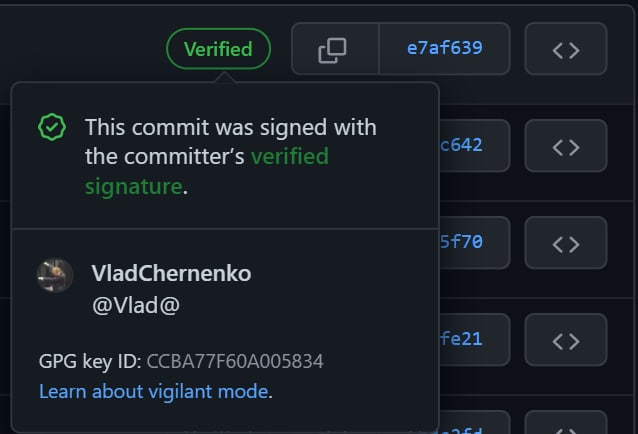
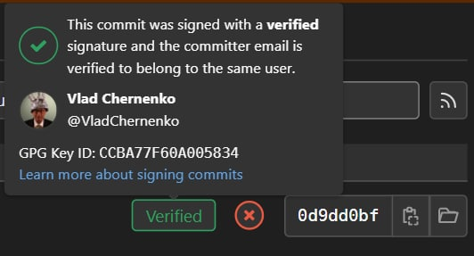

# 👮 Basic Security

This is some kind of report+maybe you can use these tips in your practise. But we think that users must know that our team cares about your protection to prevent scam schemes & fake ICO's & phishing campaigns and so on.

## <mark style="color:red;">**Commits signatures**</mark>

Here's how it looks like

 

These are screenshots of the history of branches from GitHub and GitLab - there we will place all our code, projects, documents, and so on. All commits and any code posted by members of the KlyntarTeam will have a designation that will make it clear that no third party will be able to post anything even if they somehow gain access to the account. The same goes for the hosting platforms themselves. Although we have no reason to doubt GitHub (and its owner Microsoft in particular), node operators, users and all interested parties still need to be sure that the code is published by the KLYNTAR developers. You can locally import my public GPG key (and the keys of other team members) and verify each new pull via Apollo (_<mark style="color:purple;">checkrepo</mark>_ command in CLI) or _<mark style="color:purple;">git verify-commit</mark>_. The necessary links to set up the environment are also available below. Additionally, we also have a separate repository with other keys (Ed25519, post-quantum Dilithium, etc.) that you can also use for the necessary checks


<mark style="color:red;">**Go to**</mark> [<mark style="color:purple;">**https://github.com/KLYN74R/KlyntarTeamPubKeys**</mark>](https://github.com/KLYN74R/KlyntarTeamPubKeys) <mark style="color:red;">**to get more pubkeys**</mark>



Go to [https://www.gnupg.org/gph/en/manual/x56.html](https://www.gnupg.org/gph/en/manual/x56.html) to get the help if you need


## <mark style="color:red;">Additional features</mark>

We created a separate repository for a reason. GPG does not support such a large number of algorithms (we are currently using the most reliable RSA-4096 with a passphrase with high entropy), and the capabilities of GitHub come down only to SSH & GPG. Multisignatures or, for example, post-quantum algorithms are not available here. That is why we will create something like the second level of security for which we need this repository with keys and a separate command in Apollo.

Reading the previous section, you might have wondered: “Well, ok, what if one of you forgets your laptop somewhere, pushes a private key to some public repository, or, for example, one of your team members gets offended and releases a conditional wiper-commit that will steal my private keys and wipe my entire filesystem?". Again, thanks to such additional features of cryptography as multi-signatures, we will be able to avoid such incidents. Multiple signatures are also possible (signing the commit hash with several keys of different algorithms). For example, you will know that in addition to the fact that the commit was approved and signed by the required number of team members, the commit is additionally signed by some supported post-quantum algorithm.

## <mark style="color:red;">**Git and hashes**</mark>

Currently, Git uses SHA-1 hashes by default, but since version 2.29, [_<mark style="color:purple;">experimental support</mark>_](https://www.infoq.com/news/2020/10/git-2-29-sha-256/) for switching to SHA-256 has begun. This is very important because the same link contains implementation and PoC attacks when [_<mark style="color:purple;">two different files will generate the same hash</mark>_](https://shattered.it/).

&#x20;                                                  (1) (1) (2).png>)

Although this is not critically scary, as some publications shout about it, nevertheless, questions about the reliability of SHA-1 have been of interest to people in our industry for several years now. Therefore, although GitHub is still giving an error about accepting repositories with SHA-256 hashes, repositories of plugins, services, and so on that will be distributed outside hosting platforms (and therefore, regardless of whether this platform supports innovations or not) can use SHA- 256 as a hash function of the commits. We have already tested and no problems have arisen

 (1) (1) (1) (1) (1) (1) (1) (1).png>)

At the same time, you can still sign the repository hash with third-party keys and create your own acceptance rules. For example, a service repository can only be accepted by the nodes if it is signed by the Ed25519 key pair of the service creator and the largest service token hodler, or if the acceptance of the repository supports more than 2/3 of the service validator signatures and other rules that you can create yourself.

## <mark style="color:red;">Accounts</mark>

All of our social media accounts have an MFA and their own password policy. Here we are not even talking about something different from <mark style="color:purple;">**`rockyou.txt`**</mark> or different registers, but the use of different alphabets, registers, unicode characters, emoji, text direction and special characters. Passwords are stored in cold storage and used as needed.

Of course, we use different passwords from site to site. Also, the keys for 2FA are shared between several providers and between different devices.

## <mark style="color:red;">Public data (DNS, mail) and approach paths</mark>

We are familiar with initial access tactics, phishing campaigns and more. For this reason, we monitor DNS history and records to prevent subdomain takeover attacks, zone dumps, spoofing attacks, and so on.

Soon we will also sign our zone (when there will be a full-fledged website infrastructure, and not parking pages)

All mails that are in the public domain are available to each information collector. For example, the functionality of sites allows you to update your password and thus reveals the presence of an email in your database. We ourselves analyze on which sites what was used. For example, a tool



...or this one



We use other tools and resources to collect information and try to cover as much area as possible to ensure safety on all fronts.

## <mark style="color:red;">**Access to accounts for 3rd party apps & bots**</mark>

We control which third party services and applications have access to our accounts. For workflows we use GitGuardian, our books are written using GitBook.

In everything we try to give minimum privileges and limit the access level to a minimum, so that even if the account is compromised, this will not affect our accounts / infrastructure.

GitHub and other sites that provide partial access allow us to competently operate with opportunities for third parties, which is what we use.

## <mark style="color:red;">**What about contributors?**</mark>


We will publish later when these same contributors appear 🙂


And if in a nutshell, then we also want the contributors to follow the same rules that we follow. This is the signing of your code with a separate proof through the blockchain and control of your accounts and more.

## <mark style="color:red;">Self-sustaining security with symbiotes</mark>

For sure, for the first time in the history of crypto projects, we will use our own development to ensure our own security. So symbiotes taking advantage of the decentralized nature of blockchains (and its maxima in the case of KLYNTAR) will serve as a source of public key infrastructure for us and other developers.

We will add some information about versions, key changes and so on to the symbiotes, and you can make sure that everything is reliable.

## <mark style="color:red;">**How the Continental release will help here?**</mark>

Coming soon 👻


Stay tuned - we promise even more interesting information and improvements

